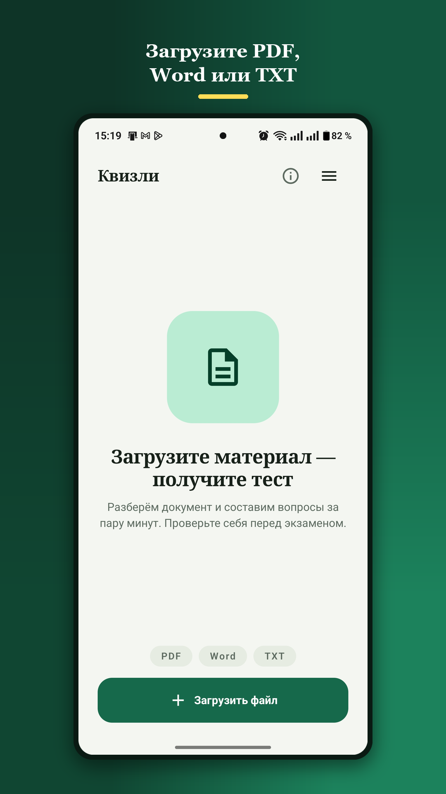
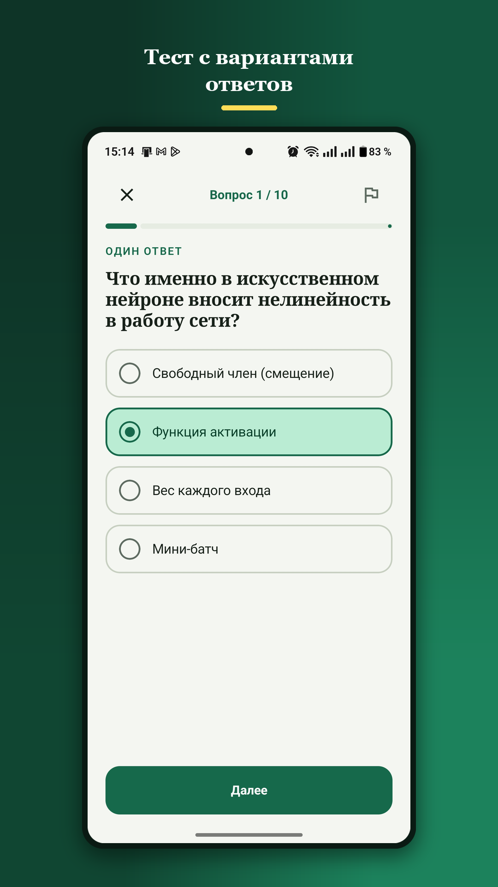
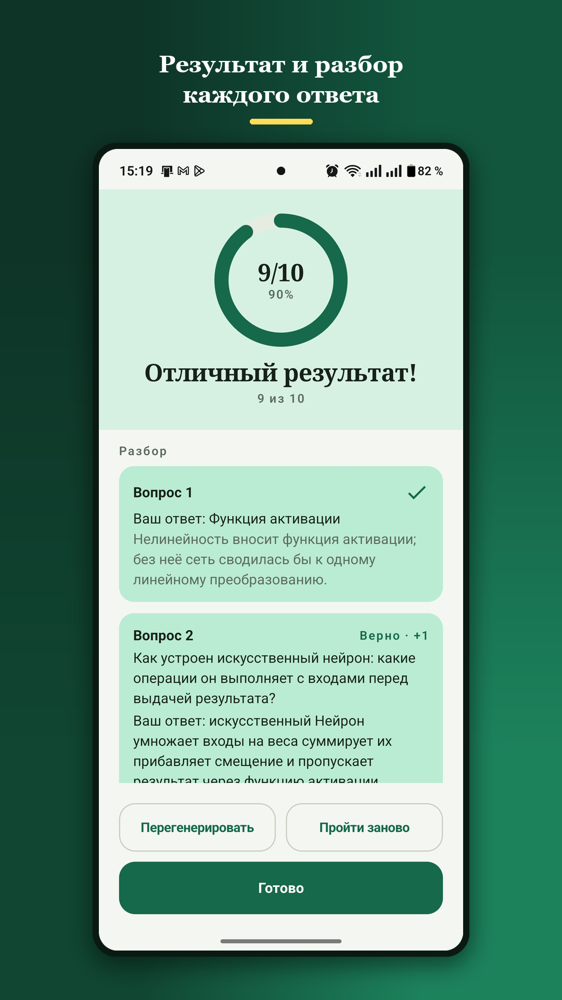

# Квизли

**Загружаешь конспект — получаешь тест по нему.** PDF, Word или TXT: приложение
разбирает документ и составляет вопросы — с вариантами ответа, открытые или и те,
и другие сразу. Открытый вопрос можно продиктовать голосом, а проверяет ответы ИИ
по смыслу, а не дословно.

Русский, английский и украинский — вопросы генерируются на языке приложения.

  
  
  

## Скачать

**[⬇️ Последняя версия](../../releases/latest)** — APK, около 1,5 МБ.

Нужен **Android 8.0** или новее.

### Как установить

1. Скачайте APK по ссылке выше.
2. Откройте файл. Android спросит разрешение на установку из этого источника
   (браузера или Telegram — смотря откуда открываете) — разрешите.
3. Готово. Приложение не просит ни аккаунта, ни разрешений, кроме интернета.

Проверить, что скачали именно оригинальный файл, можно по контрольной сумме —
она указана в описании каждого релиза.

## Что умеет

* **Тесты по вашему материалу** — вопросы с одним ответом, с несколькими и открытые
* **Настройка** — тип заданий, количество вопросов (5–20), сложность
* **Ответ голосом** — распознавание речи выполняет само устройство, аудиозапись
  никуда не отправляется
* **Проверка по смыслу** — передали суть своими словами? Засчитано. Раскрыли
  частично — половина балла и подсказка, чего не хватило
* **Перегенерация** — новый набор вопросов по тому же документу
* **Библиотека** — история документов и результатов, тест можно пройти заново
* **Тёмная тема**

## Приватность

Ни аккаунтов, ни рекламы, ни аналитики, ни трекеров. История тестов хранится
**только на вашем устройстве**. Документы не сохраняются на сервере — обрабатываются
и сразу удаляются. Всё передаётся по защищённому соединению.

Полная политика: **[quizli.duckdns.org/privacy.html](https://quizli.duckdns.org/privacy.html)**

## Вопросы составляет ИИ

Ошибки возможны — это свойство технологии, а не сбой. Если вопрос выглядит неверным,
на него можно пожаловаться прямо из теста, кнопкой с флажком.

## Обратная связь и поддержка

* Telegram-канал: **[@magerdev1](https://t.me/magerdev1)**
* Почта: **magerkopython@gmail.com**
* Поддержать проект: **[Donatello](https://donatello.to/magerdev1)** — по желанию,
  приложение бесплатное и донат ничего не разблокирует

---

Здесь публикуются только сборки. Исходный код закрыт.
